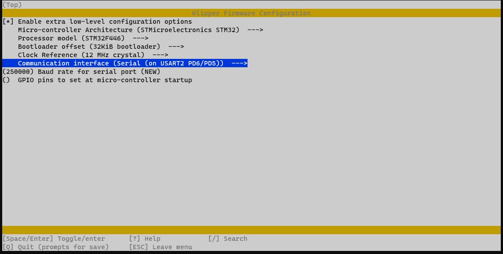
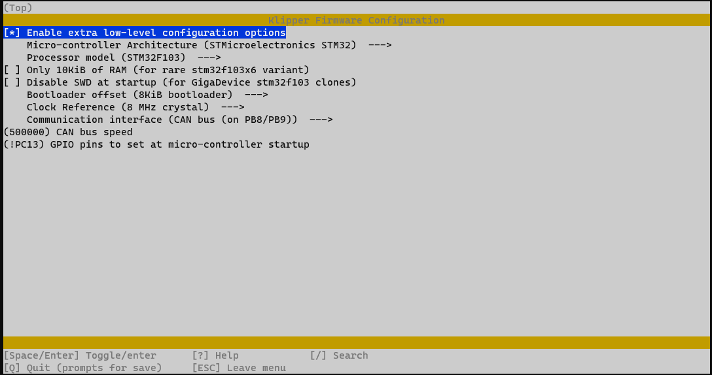
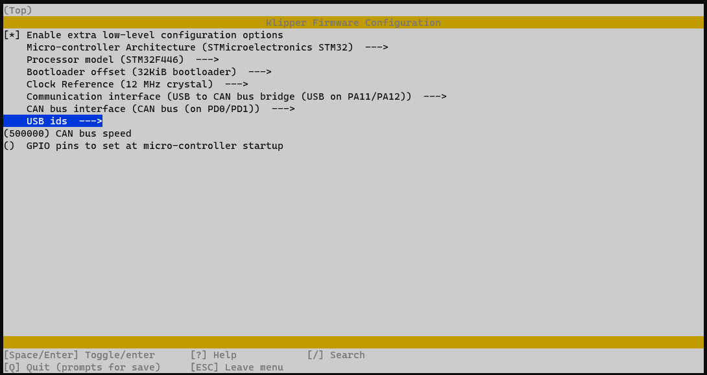

# voronpi-klipper-backup
Automated backup of klipper config

Voron 2.4 250mm v2.1906

discord: whistlinric

# Features
- [Calibrating Klipper z offset](https://github.com/protoloft/klipper_z_calibration)
- [Can Bus - SHT36 v2](https://github.com/Mellow-3D/klipper-docs/tree/master/docs/board/fly_sht_v2)
- [GE5C](https://github.com/VoronDesign/VoronUsers/tree/master/printer_mods/hartk1213/Voron2.4_GE5C)
- [Git backup](https://github.com/th33xitus/kiauh/wiki/How-to-autocommit-config-changes-to-github%3F) - using [SSH](https://docs.github.com/en/authentication/connecting-to-github-with-ssh) authentication
- [Klicky Probe](https://github.com/jlas1/Klicky-Probe) - modified macro to send out M117 messages for WLED macros
- [Nozzle Scrubber](https://github.com/VoronDesign/VoronUsers/tree/master/printer_mods/edwardyeeks/Decontaminator_Purge_Bucket_&_Nozzle_Scrubber)
- [Resonance testing with image processing](https://www.klipper3d.org/Measuring_Resonances.html) - pushing to [github](resonances) to view them is pretty easy
- [Sensorless homing](https://docs.vorondesign.com/community/howto/clee/sensorless_xy_homing.html)
- [Stealthburner with Clockwork 2](https://vorondesign.com/voron_stealthburner)
- [Voron Revo](https://e3d-online.com/products/revo-voron)
- [WLED](https://kno.wled.ge/) macros making use of [new moonraker wled component](https://moonraker.readthedocs.io/en/latest/configuration/#wled) running on a separate [d1 mini v3](https://www.aliexpress.com/item/32651747570.html)

# Links
[My Voron Mods](https://github.com/richardjm/voron-parts)
[Voron User Mods](https://github.com/VoronDesign/VoronUsers/tree/master/printer_mods)  
[https://voronregistry.com/mods](https://voronregistry.com/mods) - Also nice website for same by discord:exceptionptr  
[https://vorondesign.com/](https://vorondesign.com/)  

[BTT Octopus GitHub](https://github.com/bigtreetech/BIGTREETECH-OCTOPUS-V1.0)  
[Klipper](https://www.klipper3d.org/)  
[Ellis' PIF Profile](https://github.com/AndrewEllis93/Ellis-PIF-Profile)  
[Ellis' Print Tuning Guide](https://github.com/AndrewEllis93/Print-Tuning-Guide)  
[hartk1213 various repos](https://github.com/hartk1213)  
[hartk1213 toolhead pcbs](https://github.com/VoronDesign/Voron-Hardware/tree/master/Afterburner_Toolhead_PCB)  
[lcd_tweaks.cfg](https://github.com/VoronDesign/Voron-Documentation/blob/4a825a8704a3c8467606f58fb45ac4c377779842/community/howto/alchemyEngine/lcd_tweaks.cfg)  
[Measure_thermal_behavior - the need for backers](https://github.com/tanaes/measure_thermal_behavior)  
[Plater optimal part layout](https://github.com/Rhoban/Plater)  
[Rama's Voron Mods inc the new idlers](https://github.com/Ramalama2/Voron-2-Mods)  
[nxutil filament encoder](https://github.com/nexx/nxencoder-util)  
[http://spikerlights.com/calcpower.aspx](http://spikerlights.com/calcpower.aspx) - LED strip power injection calculator  
[https://github.com/alchemyEngine/klipper_frame_expansion_comp](https://github.com/alchemyEngine/klipper_frame_expansion_comp)  
[Klipper Estimator](https://github.com/Annex-Engineering/klipper_estimator)  
[Planetary Z drive](https://github.com/CarlosRodriguess/Galileo-Z_Modify)  

# Other klipper backups I've found useful
[https://github.com/AndrewEllis93/v2.247_backup_klipper_config](https://github.com/AndrewEllis93/v2.247_backup_klipper_config)  
[https://github.com/pushc6/VoronConfig](https://github.com/pushc6/VoronConfig)  
[https://github.com/kageurufu/3dp-voron2/tree/master/printer](https://github.com/kageurufu/3dp-voron2/tree/master/printer)  
[https://github.com/wile-e1/klipper_config](https://github.com/wile-e1/klipper_config)  
[https://github.com/th33xitus/klipper_config](https://github.com/th33xitus/klipper_config)  
[https://github.com/jktightwad/Klipper24Config](https://github.com/jktightwad/Klipper24Config)  
[https://github.com/mjoconr/Voron2.4-Config](https://github.com/mjoconr/Voron2.4-Config)  
[https://github.com/zellneralex/klipper_config](https://github.com/zellneralex/klipper_config)  

# CAN Bus for Mellow SHT36 v2
1. [Maz's github on CAN Bus](https://maz0r.github.io/klipper_canbus/)
1. Ensure your data cables are twisted
1. Ensure you have a file in `/etc/network/interfaces.d' called 'can0'
```
allow-hotplug can0
iface can0 can static
    bitrate 500000
    up ifconfig $IFACE txqueuelen 128
```

# Make menuconfigs

## Klipper - Octopus UART


## Klipper - Octopus USB


## Klipper - mellow-sht36-v2


## CanBoot - Octopus


## Klipper - Octopus USB to CAN Bridge

**Whatever I do I can't get this to work**

- https://github.com/maz0r/klipper_canbus/blob/main/controller/monster8v2.md
- https://github.com/Arksine/CanBoot
- https://www.klipper3d.org/CANBUS.html



### Some command lines

```bash
# OpenMoko is CAN bus I think
x@host:~ $ lsusb
Bus 002 Device 001: ID 1d6b:0003 Linux Foundation 3.0 root hub
Bus 001 Device 004: ID 1a86:7523 QinHeng Electronics HL-340 USB-Serial adapter
Bus 001 Device 003: ID 1d50:606f OpenMoko, Inc.
Bus 001 Device 002: ID 2109:3431 VIA Labs, Inc. Hub
Bus 001 Device 001: ID 1d6b:0002 Linux Foundation 2.0 root hub

# After flashing CAN bus Octopus the UUID goes to [mcu] canbus_uuid::
x@host:~/klipper $ ~/CanBoot/scripts/flash_can.py -i can0 -q
Resetting all bootloader node IDs...
Checking for canboot nodes...
Detected UUID: bac2e369d891, Application: Klipper
Query Complete

# Also
x@host:~/klipper $ ~/klippy-env/bin/python ~/klipper/scripts/canbus_query.py can0
Total 0 uuids found

# Double click reset button to flash via CanBoot /dev/serial
x@host:~/klipper $ ls /dev/serial/by-id/*
/dev/serial/by-id/usb-1a86_USB_Serial-if00-port0
/dev/serial/by-id/usb-CanBoot_stm32f446xx_0B0027000A50534E4E313020-if00

# Flash from klipper folder
x@host:~/klipper $ python3 ~/CanBoot/scripts/flash_can.py -d /dev/serial/by-id/usb-CanBoot_stm32f446xx_0B0027000A50534E4E313020-if00
Attempting to connect to bootloader
CanBoot Connected
Protocol Version: 1.0.0
Block Size: 64 bytes
Application Start: 0x8008000
MCU type: stm32f446xx
Flashing '/home/x/klipper/out/klipper.bin'...

[##################################################]

Write complete: 2 pages
Verifying (block count = 444)...

[##################################################]

Verification Complete: SHA = A27B43282D53034644140581F8DBB1B05BF64F7B
CAN Flash Success
```